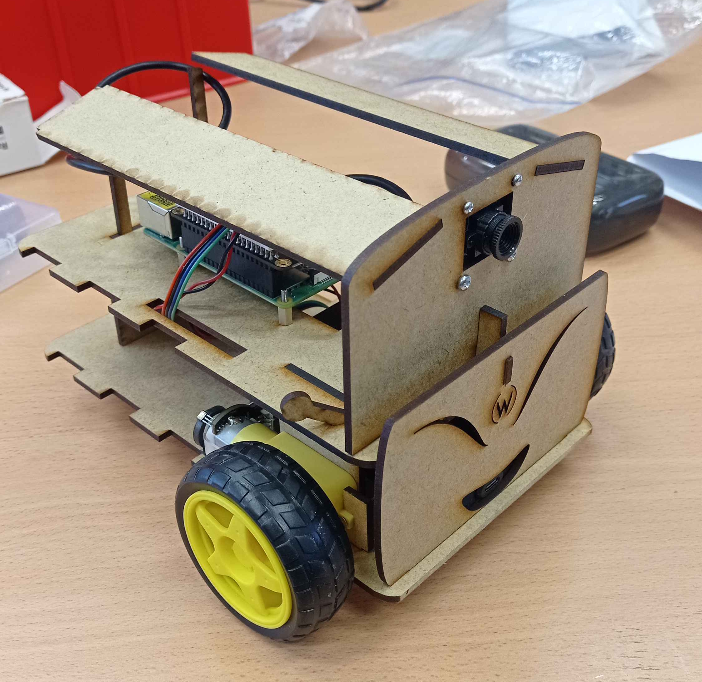
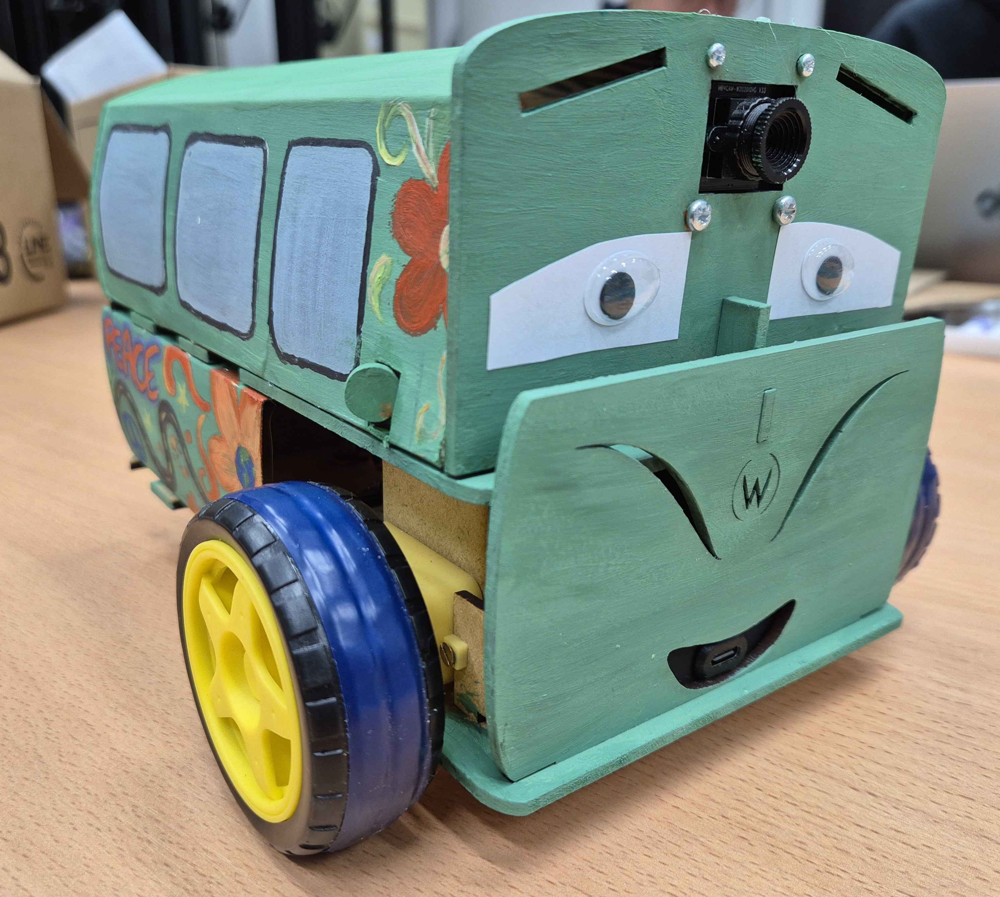
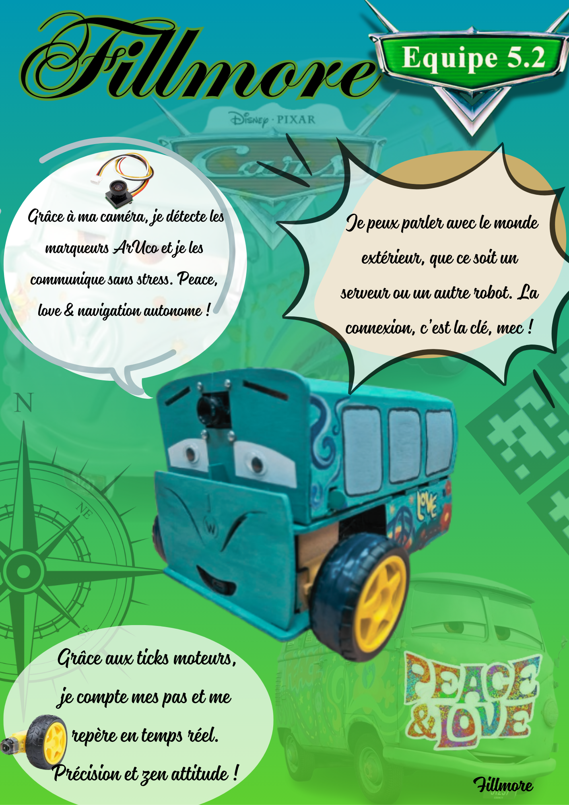

# Robots

L'objectif de ce projet était de créer une flotte de robots se déplaçant de manière coordonnée afin de scanner des QR codes. Chaque équipe était constituée de 5 robots, chacun d'entre eux réalisé par un groupe de 4 étudiants, pour un total de 20 étudiants par équipe.

Le langage de programmation utilisé était Python, notamment pour sa facilité d'utilisation.

Le robot avant / après la décoration :
 
 

## Table des matières

* [Tâches à réaliser](#tâches-à-réaliser)
* [Organisation](#organisation)
* [Apprentissages](#apprentissages)

## Tâches à réaliser

### Fabrication du robot

La première étape était de fabriquer le robot.
Le matériel de départ (batterie, roues, caméra) nous était fourni, mais nous devions ensuite fabriquer la carosserie et tout assembler / brancher.

### Contrôle des moteurs

Afin de contrôler le robot, il était nécessaire de contrôler les moteurs avec précision.
Il fallait donc réaliser un asservissement en mesurant la distance parcourue après chaque action et en la comparant à la distance théorique.

### Communication site web - robot

En plus d'un mode "conduite autonome", le robot devait pouvoir être contrôlé depuis un site web.
Il a donc fallu créer ce site web, et l'interfacer avec les fonctions existantes permettant de contrôler le robot.

### Détection des QR codes

Bien qu'il existe des librairies permettant de détecter des QR codes, il a fallu calibrer la caméra et régler des problèmes de luminosité afin que tout marche correctement.

### Coordination entre robots

Les 5 robots devant être coordonnés, il a fallu définir une stratégie de groupe, et une convention pour communiquer.
L'objectif étant de scanner le plus de QR codes possibles au total des 5 robots, les robots partageaient en continu aux autres robots la position des QR codes trouvés.

## Organisation

Le travail entre les différents robots était très indépendant.
A l'intérieur de mon groupe de 4, nous avions mis en place un système de suivi dans lequel chaque personne écrivait à la fin de la séance ce sur quoi elle avait travaillé.
Un planning établi au préalable permettait également de déterminer lorsqu'il était nécessaire de travailler chez soi en plus des heures imposées. 
Enfin, la forte diversité dans le nombre de tâches à effectuer a permis à chaque personne de travailler sur un sujet différent.

## Apprentissages

La principale difficulté de ce projet a été l'organisation : le projet était long, avec de nombreuses parties indépendantes.
De plus, l'inertie de groupe présente dans les parties impliquant l'ensemble des 20 étudiants a été sous-estimée dans les plannings.
Notre méthode d'avoir chaque membre travaillant sur un sujet différent a permis d'avancer sur plusieurs fronts à la fois.
Cependant, il est arrivé que des membres en difficulté travaillant seuls ne demandent pas d'aide, préférant mettre sous le tapis les problèmes.
Il aurait donc était pertinent de prendre plus de temps pour faire des comptes-rendus des avancées de chacun en fin de séance, au lieu de simplement dire "X avance sur Y".

Pour finir, voici l'affiche de présentation de notre robot :

